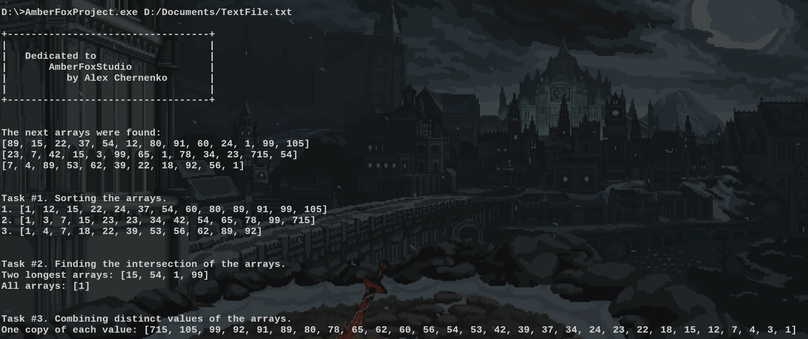
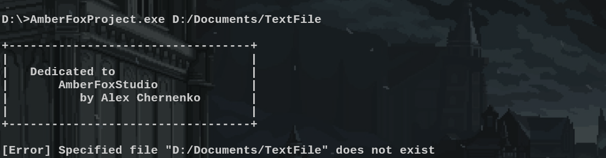
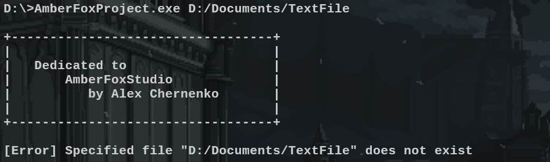
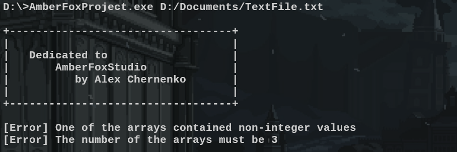

# Тестове завдання для Amber Fox Studio

Поточний проєкт представляє собою реалізацію тестового завдання для Amber Fox Studio на позицію C++ backend developer.
## Компіляція

Проєкт побудовано на [CMake](https://cmake.org/). Під час розробки як систему збірки було використано [Ninja](https://github.com/ninja-build/ninja), а в якості компілятора – [Clang](https://clang.llvm.org/cxx_status.html). Проте, оскільки проєкт було написано виключно з використанням C++11 та STL, його можливо скомпілювати за допомогою будь-якої сучасної системи збірки та компілятора, який підтримує вказану версію C++.

### Вимоги для компіляції  
Для компіляції проєкту на комп'ютері потрібно попередньо встановити:
- **CMake** (версія 3.20 або новіша).
- **Компілятор** (GCC, Clang або MSVC).  
- **Git** (для клонування репозиторію).

### Інструкція з компіляції  

Для успішної збірки проєкту, виконайте наступні кроки:  

#### 1. Клонування репозиторію  
```bash
git clone https://github.com/letsexisttogether/AmberFoxProject
cd AmberFoxProject
```
#### 2. Генерація файлів збірки 
```bash
cmake -B ./build -S ./
```
#### 3. Безпосередньо компіляція
```bash
cmake --build ./build
```
## Використання

Після того, як проєкт скомпільовано, у папці **./build** з'явиться файл з відповідною назвою **_AmberFoxProject_**, який на вхід приймає один параметр – назву файлу, у якому повинно міститися три масиви цілих чисел. Якщо не вказати шлях до файлу, то програма буде використовувати шлях за замовченням **Arrays.txt**.

### Приклад використання (на Windows)

```bash
AmberFoxProject.exe D:/Documents/TextFile.txt
```


### Обробка помилок

Якщо на вхід програми було подано шлях до файлу, якого не існує, вона реагіє відповідним чином.


Оскільки за умовою завдання було вказано, що масивів у програмі повинно бути саме 3, то відхилення від цієї норми також вважається за помилку – програма виводить відповідне повідомлення.


Додатково, програма також не буде сприймати масив, у якому хоча б одне значення не відповідає типу int (точніше std::int32_t).

## Структура проєкту

Загальна структура проєкту виглядає наступним чином.

📦 AmberFoxProject  
┣ 📂 Examples  
┣ 📂 Source  
┣ 📂 build  
┣ 📄 .gitignore  
┣ 📄 CMakeLists.txt  
┣ 📄 README.md  

Тут можна побачити стандартні файли для проєкту: **.gitignore** та **README.md**, – директорію збірки **build/**, директорію з вихідним кодом **Source/**, а також головний кофігураційний CMake файл – **CMakeLists.txt**. 

Основною базою поточного проєкту є вміст директорії **Source/**, який має наступну структуру.

📂 Source   
┣ 📂 Application  
┣ 📂 Print  
┣ 📂 Read  
┣ 📂 Spawn  
┣ 📂 Transform  
┣ 📄 Main.cpp  
┣ 📄 CMakeLists.txt

Вище можна побачити наступні основні компоненти коду:
- **Application** – клас "програми", який відповідає за почергове виконання поставлених завдань.
- **Print** – клас для виводу будь-якої одномірної колекції, елементи якої мають перевантажений оператор **<<** на екран.
- **Read** – клас **FileReader**, який відповідає за зчитування масивів з файлу. Тип масивів, які він може зчитувати було захардкоджено як цілочисельний відповідно до завдання
- **Spawn** – система класів з імплементацією породжуючого патерну *Factory Method*. Кожен клас у цій директорії (системі) слугує для створення відповідного класу з системи **Transform** з необхідною додатковою логікою.
- **Transform** – шаблонна система класів для виконання дій над масивами з будь-яким арифметичним типом даних, таких як сортування, пошук перетину (однакових елементів) масивів та отримання одиничних екземплярів кожного елементу кожного масиву в зворотньому порядку.
- **Main.cpp** – головний файл програми.
- **CMakeLists.txt** – конфігураційний файл CMake, у якому додаються до лінковки всі необхідні *.cpp файли кодової бази проєкту.
